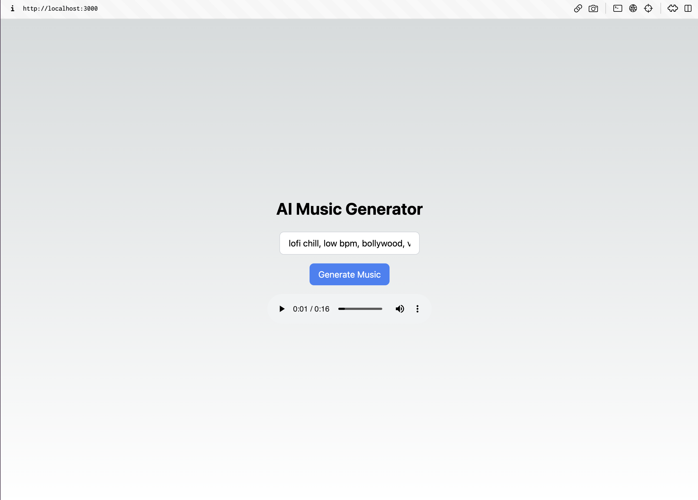

# AI_Music_Generator_Using_NEXT.js

Music has the power to evoke emotions, create moods, and tell stories. With advancements in artificial intelligence, we can now use AI to generate music compositions based on text prompts. In this tutorial, we'll explore how to build an AI music generator using Leap AI, a platform that provides access to powerful AI models, and Next.js, a popular React framework for server-side rendering.

## **Prerequisites**

To follow along with this tutorial, you should have the following prerequisites:

1. Node.js and npm (Node Package Manager) installed on your machine.
2. Basic knowledge of JavaScript and React.
3. An active Leap AI account and an API key. If you don't have one, sign up for an account on the [Leap AI website](https://app.tryleap.ai/) to get your API key.

## **Setting Up the Next.js Project**

Let's start by setting up a new Next.js project. Open your terminal and execute the following commands:

```bash

npx create-next-app ai-music-generator-leap

✔ Would you like to use TypeScript with this project? … No
✔ Would you like to use ESLint with this project? … Yes
✔ Would you like to use Tailwind CSS with this project? … Yes
✔ Would you like to use `src/` directory with this project? … Yes
✔ Use App Router (recommended)? … No
✔ Would you like to customize the default import alias? … No
```

This will create a new Next.js project in a directory named **`ai-music-generator-leap`**. Next, open the project in your preferred code editor.

```bash
cd ai-music-generator-leap
```

## **Installing Dependencies**

Next, we need to install the required dependencies for our project. In the terminal, navigate to the project directory and run the following command:

```bash
npm install @leap-ai/sdk
```

Now, create a new file called **`.env`** in the root of your project and add the following environment variables:

```sql
LEAP_API_KEY=<paste-your-token-here>
```

Retrieve your API token from your [Leap AI account settings](https://app.tryleap.ai/projects).

## **Creating the Backend**

Next, we will create a new file called **`music-generate.js`** inside the **`src/pages/api`** directory. This file will contain the code to generate AI music using the Leap AI SDK.

Add the following code to **`music-generate.js`**:

```jsx
import { Leap } from "@leap-ai/sdk";

export default async function handler(req, res) {
  const leap = new Leap(process.env.LEAP_API_KEY);

  try {
    const { prompt } = req.body;

    // Submit music generation
    const { data, error } = await leap.music.submitMusicGenerationJob({
      prompt: prompt,
      duration: 16,
      mode: "music",
    });

    console.log("SUBMIT ", data, error);

    // Check if the music is generated or not
    const { data: output, error: err } = await leap.music.listMusicGenerationJobs();

    console.log("OUTPUT ", output[output.length - 1], err);

    let song = output[output.length - 1];

    // Check if the music is generated or not
    while (song.state !== "finished") {
      // Wait every 15 seconds
      await new Promise((resolve) => setTimeout(resolve, 15000));

      if (song.state === "failed") {
        res.status(500).json({ error: "AI song generation failed" });
      }

      const { data: output, error: err } = await leap.music.listMusicGenerationJobs();
      console.log("OUTPUT ", output[output.length - 1], err);
      song = output[output.length - 1];
    }

    res.status(200).json({ music: song?.media_uri });
  } catch (error) {
    console.error("AI song generation failed:", error);
    res.status(500).json({ error: "AI song generation failed" });
  }
}
```

1. Import Dependencies: The backend code starts by importing the necessary dependencies. We import the **`Leap`** class from the **`@leap-ai/sdk`** package. This class allows us to interact with the Leap AI API.
2. Create the Handler Function: The backend code defines an asynchronous handler function using the **`async`** keyword. This function will handle incoming requests to the **`/api/music-generator-leap`** endpoint.
3. Initialize Leap AI Client: Inside the handler function, we create an instance of the **`Leap`** class by passing our API key as a parameter. The API key is stored in the **`process.env.LEAP_API_KEY`**, which should be set as an environment variable. The **`Leap`** class instance will allow us to interact with the Leap AI API.
4. Retrieve Prompt from Request: The handler function retrieves the text prompt from the request body using **`req.body.prompt`**. The prompt is the input text that the user enters to describe the desired music.
5. Submit Music Generation Job: We use the **`submitMusicGenerationJob`** method of the Leap AI client to request music generation based on the provided prompt. We pass the prompt, set the desired duration of the generated music to 16 seconds (**`duration: 16`**), and specify the mode as "music" (**`mode: "music"`**).
6. Check Music Generation Status: After submitting the music generation job, we check the status of the job using the **`listMusicGenerationJobs`** method. The returned data includes information about the music generation job, such as its state (e.g., "finished", "failed") and the URL of the generated music.
7. Polling for Music Generation Completion: We use a while loop to continuously check the status of the music generation job until it reaches the "finished" state. We wait every 15 seconds before checking the status again. If the job fails (**`song.state === "failed"`**), we handle the error by sending a response with a status code of 500 and an error message.
8. Return the Generated Music: Once the music generation is successful (**`song.state === "finished"`**), we extract the media URI of the generated music from the **`song`** object and send it as a response with a status code of 200.

You can read more about it on the [**leap ai docs**](https://docs.tryleap.ai/sdk/generating-music).

## **Creating the Frontend**

Now that the backend is set up, let's create the frontend interface using Next.js and Tailwind CSS.

1. Open the **`pages/index.js`** file in your project and replace the existing code with the following:

```jsx
import { useState } from "react";

export default function Home() {
  const [music, setMusic] = useState("");
  const [prompt, setPrompt] = useState("");
  const [isLoading, setIsLoading] = useState(false);

  const generateMusic = async () => {
    setIsLoading(true);

    try {
      const response = await fetch("/api/music-generate", {
        method: "POST",
        headers: {
          "Content-Type": "application/json",
        },
        body: JSON.stringify({ prompt }),
      });

      const { music } = await response.json();
      setMusic(music);
    } catch (error) {
      console.error("Failed to generate music:", error);
    }

    setIsLoading(false);
  };

  return (
    <div className="flex flex-col items-center justify-center h-screen">
      <h1 className="text-3xl font-bold mb-6">AI Music Generator</h1>
      <input
        type="text"
        value={prompt}
        onChange={(e) => setPrompt(e.target.value)}
        placeholder="Enter a prompt"
        className="px-4 py-2 text-black border border-gray-300 rounded-lg mb-4 w-64"
      />
      <button
        onClick={generateMusic}
        className="px-4 py-2 bg-blue-500 text-white rounded-lg hover:bg-blue-600"
        disabled={isLoading}
      >
        {isLoading ? "Generating..." : "Generate Music"}
      </button>
      {isLoading && (
        <div className="mt-4">
          <svg
            className="animate-spin h-5 w-5 mr-3 text-blue-500"
            xmlns="http://www.w3.org/2000/svg"
            fill="none"
            viewBox="0 0 24 24"
          >
            <circle
              className="opacity-25"
              cx="12"
              cy="12"
              r="10"
              stroke="currentColor"
              strokeWidth="4"
            ></circle>
            <path
              className="opacity-75"
              fill="currentColor"
              d="M4 12a8 8 0 018-8V0C5.373 0 0 5.373 0 12h4zm2 5.291A7.962 7.962 0 014 12H0c0 3.042 1.135 5.824 3 7.938l3-2.647zM12 20c3.042 0 5.824-1.135 7.938-3l-2.647-3A7.962 7.962 0 0112 16v4zm5.291-6A7.962 7.962 0 0112 20v4c4.418 0 8-3.582 8-8h-4zM16.938 3C15.824 1.135 13.042 0 10 0v4c1.79 0 3.527.684 4.826 1.938L16.937 3z"
            ></path>
          </svg>
          Generating music...
        </div>
      )}
      {music && <audio className="mt-4" controls src={music} />}
    </div>
  );
}
```

- The component uses the **`useState`** hook to manage state variables: **`music`** for storing the generated music URL, **`prompt`** for capturing the user's input, and **`isLoading`** to track the loading state during music generation.
- When the user clicks the "Generate Music" button, the **`generateMusic`** function is invoked. It sets **`isLoading`** to **`true`** to indicate that the generation process has started.
- A **`fetch`** request is made to the **`/api/music-generate`** endpoint, passing the prompt in the request body. If the request is successful, the generated music URL is stored in the **`music`** state variable.
- The loading state is managed by toggling the value of **`isLoading`**. It is set to **`false`** after the generation process completes, whether successful or with an error.
- The UI is rendered using JSX markup, including an input field for the prompt, a button to trigger the music generation, and conditional rendering to display a loader while the generation is in progress.
- If **`music`** is not empty, an **`<audio>`** element is rendered with the **`src`** attribute set to the generated music URL, allowing users to play and listen to the music.

This code implements the core functionality of the AI music generator, capturing user input, generating music based on the prompt, and providing visual feedback to the user during the generation process.

**Sample prompts:**

1. **Lofi chill beats, bollywood style, rains**
2. **techno style, high bpm, sound drop**





## Conclusion

And there you have it! You've built your very own AI music generator with Next.js and Leap AI. Just type in a fun text prompt, and voilà! Your music comes to life. 🎶🎉 It's like magic!

Now, you're the maestro, creating melodies that'll make heads turn and feet tap. 🎵 So, go ahead, try different prompts, mix it up, and explore the musical wonders you can create.

With this musical AI in your toolkit, let your imagination run wild and jam on! 🎸🎹 Happy coding and keep making awesome tunes that'll rock the world! 🤘🎶
